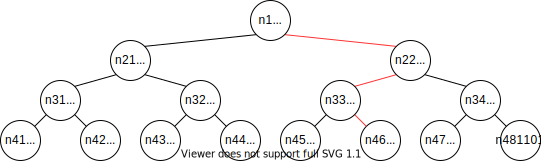

# Binary Bomb Write-Up

首先阅读`bomb.c`，描述了二进制文件`bomb`的主要逻辑。可以看到通过函数`read_line`从输入流读取字符串并重定向到函数`phase_X`。反汇编`bomb`:

```bash
objdump -d bomb > bomb.asm
```

## Phase 1

在反汇编出的`bomb.asm`中定位到`phase_1`，可以观察到如下代码：

```asm
08048b33 <phase_1>:
 8048b33:	83 ec 14             	sub    $0x14,%esp
 8048b36:	68 a4 9f 04 08       	push   $0x8049fa4
 8048b3b:	ff 74 24 1c          	pushl  0x1c(%esp)
 8048b3f:	e8 62 04 00 00       	call   8048fa6 <strings_not_equal>
 8048b44:	83 c4 10             	add    $0x10,%esp
 8048b47:	85 c0                	test   %eax,%eax
 8048b49:	74 05                	je     8048b50 <phase_1+0x1d>
 8048b4b:	e8 4d 05 00 00       	call   804909d <explode_bomb>
 8048b50:	83 c4 0c             	add    $0xc,%esp
 8048b53:	c3                   	ret    
```

其中调用了`strings_not_equal`方法，并传入两个参数`$0x8049fa4`和`0x1c(%esp)`。当返回值为真时调用`explode_bomb`方法。结合`main`方法对`phase_1`的调用上下文来看，`0x1c(%esp)`处存储了`read_line`方法的返回值，即输入字符串的首址。猜测`$0x8049fa4`处存储另一字符串。

```asm
 8048a79:	e8 7f 06 00 00       	call   80490fd <read_line>
 8048a7e:	89 04 24             	mov    %eax,(%esp)
 8048a81:	e8 ad 00 00 00       	call   8048b33 <phase_1>
```

使用`gdb`调试`bomb`，并查看`$0x8049fa4`处值。将字符串作为`phase_1`的输入，成功过关。

```shell
$ gdb ./bomb
(gdb) x/s 0x8049fa4
0x8049fa4:      "When a problem comes along, you must zip it!"
(gdb) r ans.txt
Welcome to my fiendish little bomb. You have 6 phases with
which to blow yourself up. Have a nice day!
Phase 1 defused. How about the next one?
```

## Phase 2

定位到`phase_2`，发现其调用了`read_six_numbers`。进入`read_six_numbers`，其调用了标准库函数`sscanf`，传入的格式化字符串为`$0x804a163`，通过`gdb`查看其值为`"%d %d %d %d %d %d"`。因此可以确定`read_six_numbers`的用途是从输入中读取六个数字并返回。为了方便描述，将这六个输入记作`nums[x]`（下同）。


```asm
Welcome to my fiendish little bomb. You have 6 phases with
which to blow yourself up. Have a nice day!
Phase 1 defused. How about the next one?08048b54 <phase_2>:
...
 8048b6e:	e8 4f 05 00 00       	call   80490c2 <read_six_numbers>
 8048b73:	83 c4 10             	add    $0x10,%esp
 8048b76:	83 7c 24 04 01       	cmpl   $0x1,0x4(%esp) ;if (nums[0]!=1) explode_bomb();
 8048b7b:	74 05                	je     8048b82 <phase_2+0x2e>
 8048b7d:	e8 1b 05 00 00       	call   804909d <explode_bomb>; 
 8048b82:	8d 5c 24 04          	lea    0x4(%esp),%ebx
 8048b86:	8d 74 24 18          	lea    0x18(%esp),%esi
 8048b8a:	8b 03                	mov    (%ebx),%eax ; int j = nums[i];
 8048b8c:	01 c0                	add    %eax,%eax ; j *= 2;
 8048b8e:	39 43 04             	cmp    %eax,0x4(%ebx) ; if (j==nums[i+1])
 8048b91:	74 05                	je     8048b98 <phase_2+0x44> ; if not equal, explode_bomb();
 8048b93:	e8 05 05 00 00       	call   804909d <explode_bomb>
 8048b98:	83 c3 04             	add    $0x4,%ebx ; fetch next num
 8048b9b:	39 f3                	cmp    %esi,%ebx
 8048b9d:	75 eb                	jne    8048b8a <phase_2+0x36> ; if not end, loop
...
080490c2 <read_six_numbers>:
 80490de:	68 63 a1 04 08       	push   $0x804a163
 80490e3:	ff 74 24 2c          	pushl  0x2c(%esp)
 80490e7:	e8 24 f7 ff ff       	call   8048810 <__isoc99_sscanf@plt>
```

回到`phase_2`，分析其核心逻辑。从`0x8048b76`处指令得知输入的第一个数字为`1`。`0x8048b8a`至`0x8048b9d`之间是一处循环结构，其功能为从剩余五个数字中逐一取出元素，比较其值是否为前驱元素的两倍，若是则继续循环，否则调用`explode_bomb`。因此`phase_2`的输入应为首项为1公比为2的等比数列的前六项，即`1 2 4 8 16 32`。

```
$ ./bomb ans.txt
Welcome to my fiendish little bomb. You have 6 phases with
which to blow yourself up. Have a nice day!
Phase 1 defused. How about the next one?
That's number 2.  Keep going!
```

## Phase 3

定位到`phase_3`，其调用`sscanf`读入两个数字。第一个数字`nums[0]`的值要求低于7，否则调用`explode_bomb`。从`0x8048bf2`到`0x8048c3a`是一个跳转表，根据`nums[0]`的值计算其偏移。

```asm
 8048bd0:	68 6f a1 04 08       	push   $0x804a16f; "%d %d"
 8048bd5:	ff 74 24 2c          	pushl  0x2c(%esp)
 8048bd9:	e8 32 fc ff ff       	call   8048810 <__isoc99_sscanf@plt>
 8048bde:	83 c4 10             	add    $0x10,%esp
 8048be1:	83 f8 01             	cmp    $0x1,%eax ; need 2 num
 8048be4:	7f 05                	jg     8048beb <phase_3+0x34>
 8048be6:	e8 b2 04 00 00       	call   804909d <explode_bomb>
 8048beb:	83 7c 24 04 07       	cmpl   $0x7,0x4(%esp) ; if (nums[0] > 7) boom
 8048bf0:	77 3c                	ja     8048c2e <phase_3+0x77>
 8048bf2:	8b 44 24 04          	mov    0x4(%esp),%eax ; %eax = nums[0];
 8048bf6:	ff 24 85 00 a0 04 08 	jmp    *0x804a000(,%eax,4); goto *804a000 + %eax * 4
 8048bfd:	b8 7f 03 00 00       	mov    $0x37f,%eax
 8048c02:	eb 3b                	jmp    8048c3f <phase_3+0x88>
 8048c04:	b8 13 03 00 00       	mov    $0x313,%eax
 8048c09:	eb 34                	jmp    8048c3f <phase_3+0x88>
 8048c0b:	b8 eb 01 00 00       	mov    $0x1eb,%eax
 8048c10:	eb 2d                	jmp    8048c3f <phase_3+0x88>
 8048c12:	b8 9b 01 00 00       	mov    $0x19b,%eax
 8048c17:	eb 26                	jmp    8048c3f <phase_3+0x88>
 8048c19:	b8 d4 00 00 00       	mov    $0xd4,%eax
 8048c1e:	eb 1f                	jmp    8048c3f <phase_3+0x88>
 8048c20:	b8 ba 00 00 00       	mov    $0xba,%eax
 8048c25:	eb 18                	jmp    8048c3f <phase_3+0x88>
 8048c27:	b8 7a 01 00 00       	mov    $0x17a,%eax
 8048c2c:	eb 11                	jmp    8048c3f <phase_3+0x88>
 8048c2e:	e8 6a 04 00 00       	call   804909d <explode_bomb>
 8048c33:	b8 00 00 00 00       	mov    $0x0,%eax
 8048c38:	eb 05                	jmp    8048c3f <phase_3+0x88>
 8048c3a:	b8 f9 01 00 00       	mov    $0x1f9,%eax
 8048c3f:	3b 44 24 08          	cmp    0x8(%esp),%eax ; if (nums[1]==eax)
 8048c43:	74 05                	je     8048c4a <phase_3+0x93>
 8048c45:	e8 53 04 00 00       	call   804909d <explode_bomb>
```

在`gdb`中查看跳转表，根据跳转表可以确定寄存器`eax`的值。

```shell
$ gdb ./bomb
(gdb) x/8 0x804a000
0x804a000:      0x08048c3a      0x08048bfd      0x08048c04      0x08048c0b
0x804a010:      0x08048c12      0x08048c19      0x08048c20      0x08048c27
```

`0x8048c3f`处指令比较`nums[1]`是否与`eax`相等，若不等则调用`explode_bomb`。由此可以确定第二个输入`nums[1]`的值。显然，`phase_2`有多组解。

| nums[0] |   0   |  1    |   2   |  3    | 4     |  5    |     6 | 7     |
| ------- | ---- | ---- | ---- | ---- | ---- | ---- | ---- | ---- |
| nums[1] | 505     | 895| 787 | 491 | 411 | 212 | 186 | 378 |

将上述任意一组解（例如`0 505`）作为输入，可以得到正确提示。

```
(gdb) r ans.txt
Starting program: /home/user24/repos/lab-csapp/2e/bomb/bomb ans.txt
Welcome to my fiendish little bomb. You have 6 phases with
which to blow yourself up. Have a nice day!
Phase 1 defused. How about the next one?
That's number 2.  Keep going!
Halfway there!
```

## Phase 4

定位到`phase_4`，同样调用`sscanf`读入两个数字`nums[0]`和`nums[1]`。

```asm
 8048cd7:	68 6f a1 04 08       	push   $0x804a16f; "%d %d"
 8048cdc:	ff 74 24 2c          	pushl  0x2c(%esp)
 8048ce0:	e8 2b fb ff ff       	call   8048810 <__isoc99_sscanf@plt>
```

通过分析栈内元素，可以判断下列代码调用了`func(nums[0],0,0xe)`，并判断其返回值`eax`和第二个输入`nums[1]`是否分别等于3。若不等，则调用`explode_bomb`。由此，可以推断出`nums[1]`的值为3。

```asm
 8048cf9:	83 ec 04             	sub    $0x4,%esp
 8048cfc:	6a 0e                	push   $0xe
 8048cfe:	6a 00                	push   $0x0
 8048d00:	ff 74 24 10          	pushl  0x10(%esp)
 8048d04:	e8 57 ff ff ff       	call   8048c60 <func4> ;func4(nums[0],0,0xe)
 8048d09:	83 c4 10             	add    $0x10,%esp
 8048d0c:	83 f8 03             	cmp    $0x3,%eax ; func4(nums[0],0,0xe) == 3;
 8048d0f:	75 07                	jne    8048d18 <phase_4+0x5a>
 8048d11:	83 7c 24 08 03       	cmpl   $0x3,0x8(%esp) ; nums[1] == 3
 8048d16:	74 05                	je     8048d1d <phase_4+0x5f>
 8048d18:	e8 80 03 00 00       	call   804909d <explode_bomb>
```


定位到`func_4`，可以看到代码中有两处分支结构和两处递归调用。

```asm
08048c60 <func4>:
 8048c60:	56                   	push   %esi
 8048c61:	53                   	push   %ebx
 8048c62:	83 ec 04             	sub    $0x4,%esp
 8048c65:	8b 4c 24 10          	mov    0x10(%esp),%ecx
 8048c69:	8b 5c 24 14          	mov    0x14(%esp),%ebx
 8048c6d:	8b 74 24 18          	mov    0x18(%esp),%esi
 8048c71:	89 f0                	mov    %esi,%eax
 8048c73:	29 d8                	sub    %ebx,%eax
 8048c75:	89 c2                	mov    %eax,%edx
 8048c77:	c1 ea 1f             	shr    $0x1f,%edx
 8048c7a:	01 d0                	add    %edx,%eax
 8048c7c:	d1 f8                	sar    %eax
 8048c7e:	8d 14 18             	lea    (%eax,%ebx,1),%edx
 8048c81:	39 ca                	cmp    %ecx,%edx
 8048c83:	7e 15                	jle    8048c9a <func4+0x3a>
 8048c85:	83 ec 04             	sub    $0x4,%esp
 8048c88:	83 ea 01             	sub    $0x1,%edx
 8048c8b:	52                   	push   %edx
 8048c8c:	53                   	push   %ebx
 8048c8d:	51                   	push   %ecx
 8048c8e:	e8 cd ff ff ff       	call   8048c60 <func4>
 8048c93:	83 c4 10             	add    $0x10,%esp
 8048c96:	01 c0                	add    %eax,%eax
 8048c98:	eb 1e                	jmp    8048cb8 <func4+0x58>
 8048c9a:	b8 00 00 00 00       	mov    $0x0,%eax
 8048c9f:	39 ca                	cmp    %ecx,%edx
 8048ca1:	7d 15                	jge    8048cb8 <func4+0x58>
 8048ca3:	83 ec 04             	sub    $0x4,%esp
 8048ca6:	56                   	push   %esi
 8048ca7:	83 c2 01             	add    $0x1,%edx
 8048caa:	52                   	push   %edx
 8048cab:	51                   	push   %ecx
 8048cac:	e8 af ff ff ff       	call   8048c60 <func4>
 8048cb1:	83 c4 10             	add    $0x10,%esp
 8048cb4:	8d 44 00 01          	lea    0x1(%eax,%eax,1),%eax
 8048cb8:	83 c4 04             	add    $0x4,%esp
 8048cbb:	5b                   	pop    %ebx
 8048cbc:	5e                   	pop    %esi
 8048cbd:	c3                   	ret    
```

用C++实现该逻辑，进一步简化并写出解答程序：

```cpp
int func4(int cx, int bx, int si) {
  int ax = si - bx;
  int dx = (unsigned)ax << 31;
  ax += dx;
  ax >>= 1;
  dx = ax + bx;
  if (dx <= cx) {
    ax = 0;
    if (dx != cx) {
      dx += 1;
      ax = func4(cx, dx, si);
      ax = 2 * ax + 1;
    }
  } else {
    dx -= 1;
    ax = func4(cx, bx, dx);
    ax = 2 * ax;
  }
  return ax;
}

int main() {
  int res = 0;
  for (int i = 0; i < 0xe; i++) {
    if (func4(i, 0, 0xe) == 3) {
      std::cout << i << "\n";
      break;
    }
  }
  return 0;
}
```

编译执行，得到满足`func4(nums[0],0,0xe) == 3`时`nums[0]`的取值为12。故`phase_4`的解为`12 3`。

```
$ g++ func4.cc ;and ./a.out
12
$ ./bomb ans.txt
Welcome to my fiendish little bomb. You have 6 phases with
which to blow yourself up. Have a nice day!
Phase 1 defused. How about the next one?
That'shells number 2.  Keep going!
Halfway there!
So you got that one.  Try this one.
```

## Phase 5

定位到`phase_5`。通过分析，其接受一个长度为6的字符串。将每个字符取低四位并映射到内存中的某一单元，将这些值累加并判断其是否为常数`0x45`（十进制69）。

```asm
08048d33 <phase_5>:
 8048d33:	53                   	push   %ebx
 8048d34:	83 ec 14             	sub    $0x14,%esp
 8048d37:	8b 5c 24 1c          	mov    0x1c(%esp),%ebx
 8048d3b:	53                   	push   %ebx
 8048d3c:	e8 46 02 00 00       	call   8048f87 <string_length>
 8048d41:	83 c4 10             	add    $0x10,%esp
 8048d44:	83 f8 06             	cmp    $0x6,%eax ; input length = 6
 8048d47:	74 05                	je     8048d4e <phase_5+0x1b>
 8048d49:	e8 4f 03 00 00       	call   804909d <explode_bomb>
 8048d4e:	89 d8                	mov    %ebx,%eax ; eax = input_str
 8048d50:	83 c3 06             	add    $0x6,%ebx ; ebx = '/0'
 8048d53:	b9 00 00 00 00       	mov    $0x0,%ecx ; ecx = 0
 8048d58:	0f b6 10             	func4movzbl (%eax),%edx ; char x form input_str
 8048d5b:	83 e2 0f             	and    $0xf,%edx ; lowest 4 bits of edx
 8048d5e:	03 0c 95 20 a0 04 08 	add    0x804a020(,%edx,4),%ecx; ecx += *(0x804a020 + 4 * edx_)
 8048d65:	83 c0 01             	add    $0x1,%eax
 8048d68:	39 d8                	cmp    %ebx,%eax ; if next char is null
 8048d6a:	75 ec                	jne    8048d58 <phase_5+0x25>
 8048d6c:	83 f9 45             	cmp    $0shellx45,%ecx
 8048d6f:	74 05                	je     8048d76 <phase_5+0x43>
 8048d71:	e8 27 03 00 00       	call   804909d <explode_bomb>
 8048d76:	83 c4 08             	add    $0x8,%esp
 8048d79:	5b                   	pop    %ebx
 8048d7a:	c3                   	ret    
```

注意到一处计算偏移值的查表操作，其基址是`0x804a020`。考虑到第四位最多表示16个数，故该表的最大有效长度为16。在`gdb`中查看其值。

```
$ gdb ./bomb
(gdb) x/16d 0x804a020
0x804a020 <array.3249>: 		2       10      6       1
0x804a030 <array.3249+16>:      12      16      9       3
0x804a040 <array.3249+32>:      4       7       14      5
0x804a050 <array.3249+48>:      11      8       15      13
```

要求构造一个六位字符串，使其值映射到上表中并求和等于69。通过查表，可以构造满足条件的字符串如`"lllldo"`。若考虑全部情况，本质上是一道动态规划问题，此处囿于篇幅不作进一步阐释。

```
(gdb) r ans.txt
Starting program: /home/user24/repos/lab-csapp/2e/bomb/bomb ans.txt
Welcome to my fiendish little bomb. You have 6 phases with
which to blow yourself up. Have a nice day!
Phase 1 defused. How about the next one?
That's number 2.  Keep going!
Halfway there!
So you got that one.  Try this one.
Good work!  On to the next...
```

## Phase 6

定位到`phase_6`，发现一处`read_six_number`调用。由`phase_2`相关分析可知，从输入中读取六个数字。

```asm
 8048d95:	e8 28 03 00 00       	call   80490c2 <read_six_numbers>
 ...
 8048dfe:	ba 3c c1 04 08       	mov    $0x804c13c,%edx
```

注意到函数体内有一处访问内存地址`0x804c13c`。使用`gdb`查看其值如下表格。可以观察到对于每一个node，偏移地址+24处值恰好为另一个node的地址。偏移地址+0处内容推测为node的id，+8和+16处为node的值。显然这是一个结构链表，简化了其余代码的分析。

| ADDRESS            | id       | this_val      | next_val | next     |
| ------------------ | -------- | ------------- | -------- | -------- |
| 0x0804c13c <node1> | 00000001 | 00000257      | 000002cc | 0804c148 |
| 0x0804c148 <node2> | 00000002 | 000002cc      | 0000035e | 0804c154 |
| 0x0804c154 <node3> | 00000003 | 0000035eshell | 000000e4 | 0804c160 |
| 0x0804c160 <node4> | 00000004 | 000000e4      | 00000248 | 0804c16c |
| 0x0804c16c <node5> | 00000005 | 00000248      | 000002db | 0804c178 |
| 0x0804c178 <node6> | 00000006 | 000002db      | 0c077307 | 00000000 |

首先分析完成调用`read_six_number`后的代码段。可以发现这一部分代码是两层循环结构，遍历输入读取的六个数``num[i]``进行比对，保证该六个数不相等，否则调用`explode_bomb`。并且输入`num[i]`的值范围在1-6。

```asm
 8048d9d:	be 00 00 00 00       	mov    $0x0,%esi; i = 0; loop below!
 8048da2:	8b 44 b4 0c          	mov    0xc(%esp,%esi,4),%eax; loop 1, eax = nums[i]
 8048da6:	83 e8 01             	sub    $0x1,%eax; eax -= 1;
 8048da9:	83 f8 05             	cmp    $0x5,%eax; if eax > 5, boom!
 8048dac:	76 05                	jbe    8048db3 <phase_6+0x38>
 8048dae:	e8 ea 02 00 00       	call   804909d <explode_bomb>
 8048db3:	83 c6 01             	add    $0x1,%esi; i++
 8048db6:	83 fe 06             	cmp    $0x6,%esi; i == 6, end loop1
 8048db9:	74 33                	je     8048dee <phase_6+0x73>; loop 6 times
 8048dbb:	89 f3                	mov    %esi,%ebx; ebx = i
 8048dbd:	8b 44 9c 0c          	mov    0xc(%esp,%ebx,4),%eax; loop2, eax = list[i+1].this_val
 8048dc1:	39 44 b4 08          	cmp    %eax,0x8(%esp,%esi,4); list[i].this_val != list[i+1].this_val
 8048dc5:	75 05                	jne    8048dcc <phase_6+0x51>
 8048dc7:	e8 d1 02 00 00       	call   804909d <explode_bomb>
 8048dcc:	83 c3 01             	add    $0x1,%ebx; ebx++
 8048dcf:	83 fb 05             	cmp    $0x5,%ebx; ebx <=5
 8048dd2:	7e e9                	jle    8048dbd <phase_6+0x42>; loop2, no repeat num
 8048dd4:	eb cc                	jmp    8048da2 <phase_6+0x27>; loop 1
```

之后分析剩余代码。其功能是遍历`0x0804c13c`处的链表，根据输入`nums`中数的顺序取出对应节点的地址并访问其`this_val`。要求前一个结点值小于后一个节点值。

```asm
esiesi8048dd6:	8b 52 08             	mov    0x8(%edx),%edx; ebx = 6
 8048dd9:	83 c0 01             	add    $0x1,%eax
 8048ddc:	39 c8                	cmp    %ecx,%eax
 8048dde:	75 f6                	jne    8048dd6 <phase_6+0x5b>
 8048de0:	89 54 b4 24          	mov    %edx,0x24(%esp,%esi,4)
 8048de4:	83 c3 01             	add    $0x1,%ebx
 8048de7:	83 fb 06             	cmp    $0x6,%ebx
 80Congratulations! You've defused the bomb!
Congratulations! You've defused the bomb!
48dea:	75 07                	jne    8048df3 <phase_6+0x78>
 8048dec:	eb 1c                	jmp    8048e0a <phase_6+0x8f>
 8048dee:	bb 00 00 00 00       	mov    $0x0,%ebx; ebx = 0
 8048df3:	89 de                	mov    %ebx,%esi; esi = ebx
 8048df5:	8b 4c 9c 0c          	mov    0xc(%esp,%ebx,4),%ecx
 8048df9:	b8 01 00 00 00       	mov    $0x1,%eax
 8048dfe:	ba 3c c1 04 08       	mov    $0x804c13c,%edx
 8048e03:	83 f9 01             	cmp    $0x1,%ecx
 8048e06:	7f ce                	jg     8048dd6 <phase_6+0x5b>
 8048e08:	eb d6                	jmp    8048de0 <phase_6+0x65>
 8048e0a:	8b 5c 24 24          	mov    0x24(%esp),%ebx
 8048e0e:	8d 44 24 24          	lea    0x24(%esp),%eax
 8048e12:	8d 74 24 38          	lea    0x38(%esp),%esi
 8048e16:	89 d9                	mov    %ebx,%ecx
 8048e18:	8b 50 04             	mov    0x4(%eax),%edx
 8048e1b:	89 51 08             	mov    %edx,0x8(%ecx)
 8048e1e:	83 c0 04             	add    $0x4,%eax
 8048e21:	89 d1                	mov    %edx,%ecx
 8048e23:	39 f0                	cmp    %esi,%eax
 8048e25:	75 f1                	jne    8048e18 <phase_6+0x9d>
 8048e27:	c7 42 08 00 00 00 00 	movl   $0x0,0x8
 8048e38:	39 03                	cmp    %eax,(%ebx) ; prev <= next
 8048e3a:	7e 05                	jle    8048e41 <phase_6+0xc6>
 8048e3c:	e8 5c 02 00 00       	call   804909d <explode_bomb>
 8048e41:	8b 5b 08             	mov    0x8(%ebx),%ebx
 8048e44:	83 ee 01             	sub    $0x1,%esi
 8048e47:	75 ea                	jne    8048e33 <phase_6+0xb8>
 8048e49:	8b 44 24 3c          	mov    0x3c(%esp),%eax
 8048e4d:	65 33 05 14 00 00 00 	xor    %gs:0x14,%eax
 8048e54:	74 05                	je     8048e5b <phase_6+0xe0>
```

根据链表值进行升序排列，节点之间关系如下。

```
node4 < node5 < node1 < node2 < node6 < node3
```

根据上述分析，可以构造输入字符串`4 5 1 2 6 3`。运行程序，成功拆解。

```
(gdb) r ans.txt
Starting program: /home/user24/repos/lab-csapp/2e/bomb/bomb ans.txt
Welcome to my fiendish little bomb. You have 6 phases with
which to blow yourself up. Have a nice day!
Phase 1 defused. How about the next one?
That's number 2.  Keep going!
Halfway there!
So you got that one.  Try this one.
Good work!  On to the next...
Congratulations! You've defused the bomb!
```

## Secret Phase

浏览反汇编结果，有一段名为`secret_phase`代码段。全局文本搜索查找其调用，发现`phase_defused`调用了`secret_phase`。

```asm
08048eb2 <secret_phase>:
...
080491f6 <phase_defused>:
...
8049269:	e8 44 fc ff ff       	call   8048eb2 <secret_phase>
...
```

进入`phase_defused`，其中有如下代码段。调用`sscanf`从内存地址`0x804c4d0`处读取形如`"%d %d %s"`的输入模式。

```asm
 8049220:	68 c9 a1 04 08       	push   $0x804a1c9; "%d %d %s"
 8049225:	68 d0 c4 04 08       	push   $0x804c4d0
 804922a:	e8 e1 f5 ff ff       	call   8048810 <__isoc99_sscanf@plt>
```

在`gdb`中打印`0x804c4d0`，得知它是一个名为`input_strings`的字符串。虽此前代码中并未出现变量`input_strings`，结合函数功能可以推测其值是从输入获取。涉及输入的函数有`read_line`和`read_six_number`，但`read_six_number`仅调用了一次`sscanf`从已获得的字符串读取内容。因为可以判断`input_strings`是从`read_line`中获得。

```shell
(gdb) x 0x804c4d0
0x804c4d0 <input_strings+240>:  ""
```

根据格式化字符形式`"%d %d %s"`与`phase_4`中`"%d %d"`形式接近，进入`phase_4`。`0x2c(%esp)`处为源字符串

```asm
 8048cd7:	68 6f a1 04 08       	push   $0x804a16f; "%d %d"
 8048cdc:	ff 74 24 2c          	pushl  0x2c(%esp)
 8048ce0:	e8 2b fb ff ff       	call   8048810 <__isoc99_sscanf@plt>
```

在`8048cdc`处下断点，并打印`esp`和``0x2c(%esp)``的值。发现此处便是`input_strings`。

```shell
Breakpoint 6, 0x08048cdc in phase_4 ()
(gdb) i reg esp
esp            0xffffd174          0xffffd174
(gdb) x/w 0xffffd1a0 # 0xffffd174 + 0x2c
0xffffd1a0:     0x0804c4d0
(gdb) x 0x0804c4d0
0x804c4d0 <input_strings+240>:  0x33203231
(gdb) x/s 0x0804c4d0
0x804c4d0 <input_strings+240>:  "12 3"
```

回到`phase_defused`，调用了`strings_not_equal`。通过`gdb`查看内存地址`0x804a1d2`对应字符串`"DrEvil"`。故输入模式的第三个位置应为`"DrEvil"`。将phase_4的题解改为`"12 3 DrEvil"`并运行，可以看到提示`"Curses, you've found the secret phase! But finding it and solving it are quite different..."`。成功进入`secret_phase`。

```asm
 804923a:	68 d2 a1 04 08       	push   $0x804a1d2 ; "DrEvil"
 804923f:	8d 44 24 18          	lea    0x18(%esp),%eax
 8049243:	50                   	push   %eax
 8049244:	e8 5d fd ff ff       	call   8048fa6 <strings_not_equal>
```

进入`secret_phase`，观察到其调用了`read_line`来读取一行输入，并将输入作为第二个参数传递给`fun7`。根据`cmp`指令可知，要求`fun7`返回值为5。

```asm
 8048eb6:	e8 42 02 00 00       	call   80490fd <read_line>
 8048ebb:波明白	83 ec 04             	sub    $0x4,%esp
 8048ebe:	6a 0a                	push   $0xa
 8048ec0:	6a 00                	push   $0x0
 8048ec2:	50                   	push   %eax
 8048ec3:	e8 b8 f9 ff ff       	call   8048880 <strtol@plt>
 8048ec8:	89 c3                	mov    %eax,%ebx ; line
 ...
 8048edf:	53                   	push   %ebx
 8048ee0:	68 88 c0 04 08       	push   $0x804c088
 8048ee5:	e8 77 ff ff ff       	call   8048e61 <fun7>
 8048eea:	83 c4 10             	add    $0x10,%esp
 8048eed:	83 f8 05             	cmp    $0x5,%eax ; fun7(tree,line)==5
 8048ef0:	74 05                	je     8048ef7 <secret_phasWe+0x45>
 8048ef2:	e8 a6 01 00 00       	call   804909d <explode_bomb>
```

`fun7`的第一个参数为内存地址`0x804c088`。查看该处内存，很明显是一颗完全二叉树。其值整理成表格如下。

| ADDR              | val(+0)    | left(+4)   | right(+8)  |
| ----------------- | ---------- | ---------- | ---------- |
| 0x0804c088 <n1>:  | 0x00000024 | 0x0804c094 | 0x0804c0a0 |
| 0x0804c094 <n21>: | 0x00000008 | 0x0804c0c4 | 0x0804c0ac |
| 0x0804c0a0 <n22>: | 0x00000032 | 0x0804c0b8 | 0x0804c0d0 |
| 0x0804c0ac <n32>: | 0x00000016 | 0x0804c118 | 0x0804c100 |
| 0x0804c0b8 <n33>: | 0x0000002d | 0x0804c0dc | 0x0804c124 |
| 0x0804c0c4 <n31>: | 0x00000006 | 0x0804c0e8 | 0x0804c10c |
| 0x0804c0d0 <n34>: | 0x0000006b | 0x0804c0f4 | 0x0804c130 |
| 0x0804c0dc <n45>: | 0x00000028 | 0x00000000 | 0x00000000 |
| 0x0804c0e8 <n41>: | 0x00000001 | 0x00000000 | 0x00000000 |
| 0x0804c0f4 <n47>: | 0x00000063 | 0x00000000 | 0x00000000 |
| 0x0804c100 <n44>: | 0x00000023 | 0x00000000 | 0x00000000 |
| 0x0804c10c <n42>: | 0x00000007 | 0x00000000 | 0x00000000 |
| 0x0804c118 <n43>: | 0x00000014 | 0x00000000 | 0x00000000 |
| 0x0804c124 <n46>: | 0x0000002f | 0x00000000 | 0x00000000 |
| 0x0804c130 <n48>: | 0x000003e9 | 0x00000000 | 0x00000000 |

进入`fun7`。可以看到此处出现了分支结构和递归调用。

```asm
08048e61 <fun7>:
 8048e61:	53                   	push   %ebx
 8048e62:	83 ec 08             	sub    $0x8,%esp
 8048e65:	8b 54 24 10          	mov    0x10(%esp),%edx; tree (ptr)
 8048e69:	8b 4c 24 14          	mov    0x14(%esp),%ecx; input
 8048e6d:	85 d2                	test   %edx,%edx ; if tree==nullptr
 8048e6f:	74 37                	je     8048ea8 <fun7+0x47> ;return -1
 8048e71:	8b 1a                	mov    (%edx),%ebx; ebx=tree->val
 8048e73:	39 cb                	cmp    %ecx,%ebx; if tree->val <= input
 8048e75:	7e 13                	jle    8048e8a <fun7+0x29>
 8048e77:	83 ec 08             	sub    $0x8,%esp
 8048e7a:	51                   	push   %ecx
 8048e7b:	ff 72 04             	pushl  0x4(%edx); tree=tree->left
 8048e7e:	e8 de ff ff ff       	call   8048e61 <fun7>; eax = fun7(tree, input)
 8048e83:	83 c4 10             	add    $0x10,%esp
 8048e86:	01 c0                	add    %eax,%eax; eax *=2;
 8048e88:	eb 23                	jmp    8048ead <fun7+0x4c>; return eax
 8048e8a:	b8 00 00 00 00       	mov    $0x0,%eax; eax = 0
 8048e8f:	39 cb                	cmp    %ecx,%ebx; if tree->val = input
 8048e91:	74 1a                	je     8048ead <fun7+0x4c>; return 0
 8048e93:	83 ec 08             	sub    $0x8,%esp
 8048e96:	51                   	push   %ecx
 8048e97:	ff 72 08             	pushl  0x8(%edx); tree=tree->right
 8048e9a:	e8 c2 ff ff ff       	call   8048e61 <fun7>; eax = fun7(tree, input)
 8048e9f:	83 c4 10             	add    $0x10,%esp
 8048ea2:	8d 44 00 01          	lea    0x1(%eax,%eax,1),%eax; eax = 2*eax + 1
 8048ea6:	eb 05                	jmp    8048ead <fun7+0x4c>; return eax
 8048ea8:	b8 ff ff ff ff       	mov    $0xffffffff,%eax
 8048ead:	83 c4 08             	add    $0x8,%esp
 8048eb0:	5b                   	pop    %ebx
 8048eb1:	c3                   	ret    
```

使用C++实现相关逻辑，并等价化简。

```cpp
int fun7(Node* node, int input) {
  if (node == nullptr) return -1;
  if (node->val == input)
    return 0;
  else if (node->val < input)
    return 2 * fun7(node->right, input) + 1;
  else if (node->val > input)
    return 2 * fun7(node->left, input);
}
```

可以构造符合条件的输入`47`，使得`fun7`的返回值为5。



执行`bomb`，验证结果：

```
$ ./bomb ans.txt 
Welcome to my fiendish little bomb. You have 6 phases with
which to blow yourself up. Have a nice day!
Phase 1 defused. How about the next one?
That's number 2.  Keep going!
Halfway there!
So you got that one.  Try this one.
Good work!  On to the next...
Curses, you've found the secret phase!
But finding it and solving it are quite different...
Wow! You've defused the secret stage!
Congratulations! You've defused the bomb!
```

至此，Binary Bomb完全拆解。